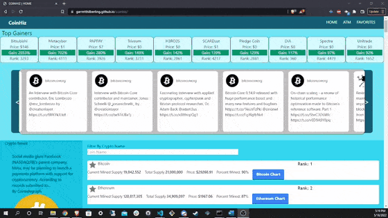

# Coinhiz
# React Portfolio

## Table of Contents
* [Description](#Description)
* [Installation](#Installation)
* [Usage](#Usage)
* [Questions](#Questions)
* [Credits](#Credits)

## Description
CoinHiz is a cryptocurrency focused application where users can track price trends of top coins, the top gainers, news in the industry, percentage mined, and even see a responsive chart showing the price history of a given coin (my feature). I also handled much of the styling for this application as well as contributing to the favorites functionality. The languages, technologies, and frameworks used to build this application are: HTML, CSS, Javascript, Jquery, CSS, and Tailwind CSS. Data is pulled by fetching from multiple sophisticated APIs.

## Usage
See the top gainers at the top of section of the page. See what coins people are talking about ib the Twitter feed just below that. See the top coins and a chart showing their price history. Favorite coins and see them presented on the Favorites page. Search for a Bitcoin ATM near you (currently inactive).

    

    
## Installation
No installation required! View the application in full via the [deployed URL](https://garretthilberling.github.io/hilberling-react-portfolio/).

## Questions
If you have any questions about this project, please contact me via GitHub [here](https://github.com/garretthilberling)!

## Credits
This project was created by:
* Garrett Hilberling: [LinkedIn](https://www.linkedin.com/in/garretthilberling/)

    

House for Crypto Coins showing a coin's market supply vs how many coins have been mined.  How fast coins are being mined and the price index for each coin.

## Built off of HTML, CSS, Javascript, JQuery
Built off HTML, CSS, Javascript, Jquery and Tailwind for CSS.

### Live Link
https://garretthilberling.github.io/coinhiz/

#### Who is this for?
Anyone interested in the fascinating world of Crypto can use this as a guide to find the top coins, how many are in production, and how many are still left to be mined.

##### How to use?
Find the top coin gainer for the past 24 hours, latest twitter feed postings, and info with charts on top the 100 coins.  

